# Config Servers en MongoDB — Arquitectura de Sharding

## Diagrama

> Hacé click sobre la imagen para abrirla en tamaño completo.

[](mongodb_config_servers_sharding.svg)

---

## ¿Qué son los config servers?

Los **config servers** son parte de la arquitectura de **sharding** (fragmentación horizontal de datos) de MongoDB. Su rol es **almacenar los metadatos del clúster**:

- Qué colecciones están sharded.
- Qué **rangos de claves** (chunks) viven en qué shard.
- Configuración general del clúster (usuarios, roles a nivel de cluster, etc.).

Sin ellos, el clúster **no sabe cómo enrutar las consultas** y queda inutilizable.

> ⚠️ **Importante:** los config servers **no guardan datos de la aplicación**, sólo el "mapa" del clúster. Por eso son livianos pero **críticos**.

---

## Las tres capas de la arquitectura

| Capa | Componente | Rol |
|---|---|---|
| 1 | **Aplicación / Cliente** | Conecta a `mongos` como si fuera un MongoDB normal. |
| 2 | **`mongos` (router)** | Recibe la query, consulta al CSRS dónde están los datos y la enruta al/los shard/s correctos. No persiste datos. |
| 3 | **CSRS** (Config Server Replica Set) | Guarda los metadatos del clúster. Siempre 3 nodos en Replica Set. |
| 3 | **Shards** | Cada shard es a su vez un Replica Set y guarda **una porción** de los datos reales. |

### Flujo de una consulta

1. La aplicación se conecta al `mongos`.
2. El `mongos` consulta al **CSRS** para saber en qué shard están los datos pedidos.
3. El `mongos` redirige la query al shard correcto (o a varios si hace falta hacer *scatter–gather*).
4. El shard responde, `mongos` consolida y devuelve el resultado al cliente.

---

## ¿Por qué siempre 3 config servers?

En producción se usan **3 config servers** organizados como un **Replica Set** llamado **CSRS** (*Config Server Replica Set*) para garantizar **alta disponibilidad**:

- 1 **PRIMARY** que acepta escrituras de metadatos.
- 2 **SECONDARY** que replican los metadatos.

Si el primario cae, los secundarios **eligen uno nuevo automáticamente** y el clúster sigue funcionando sin intervención manual.

> Hace falta una **mayoría** (2 de 3) para elegir un nuevo primario — por eso 3 nodos es el mínimo recomendado.

---

## Ejemplo concreto de configuración

```js
// 1) Iniciar el Replica Set de config servers (en uno de los nodos cfgN)
rs.initiate({
  _id: "csrs",
  configsvr: true,                // ← marca el RS como Config Server
  members: [
    { _id: 0, host: "cfg1:27019" },
    { _id: 1, host: "cfg2:27019" },
    { _id: 2, host: "cfg3:27019" }
  ]
})

// 2) Arrancar mongos apuntando al CSRS (desde la línea de comandos):
//    mongos --configdb csrs/cfg1:27019,cfg2:27019,cfg3:27019

// 3) Conectarse al mongos y agregar los shards:
sh.addShard("shard1/s1rs1:27018,s1rs2:27018,s1rs3:27018")
sh.addShard("shard2/s2rs1:27018,s2rs2:27018,s2rs3:27018")

// 4) Habilitar sharding en una base de datos y elegir la shard key
//    de una colección:
sh.enableSharding("miBaseDatos")
sh.shardCollection("miBaseDatos.usuarios", { userId: 1 })
```

### Convenciones de puertos

| Puerto | Uso típico |
|---|---|
| `27017` | `mongod` standalone / `mongos` |
| `27018` | Nodos de un **shard** (mongod con `--shardsvr`) |
| `27019` | Nodos del **CSRS** (mongod con `--configsvr`) |

---

## Punto clave para recordar

> Los **config servers no guardan datos de la app** — sólo el "mapa" del clúster.
> Sin ellos, `mongos` no sabe a dónde mandar las queries y todo el clúster deja de responder.

Por eso, aunque sean livianos en cuanto a almacenamiento, son **el corazón operativo** del sharding y siempre se despliegan replicados.
